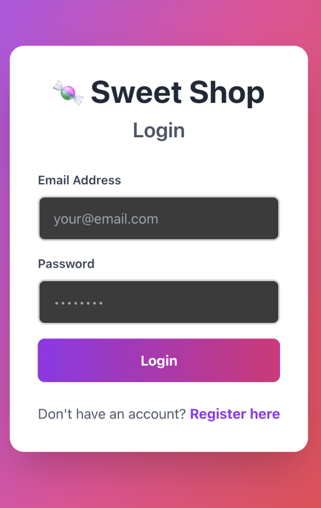
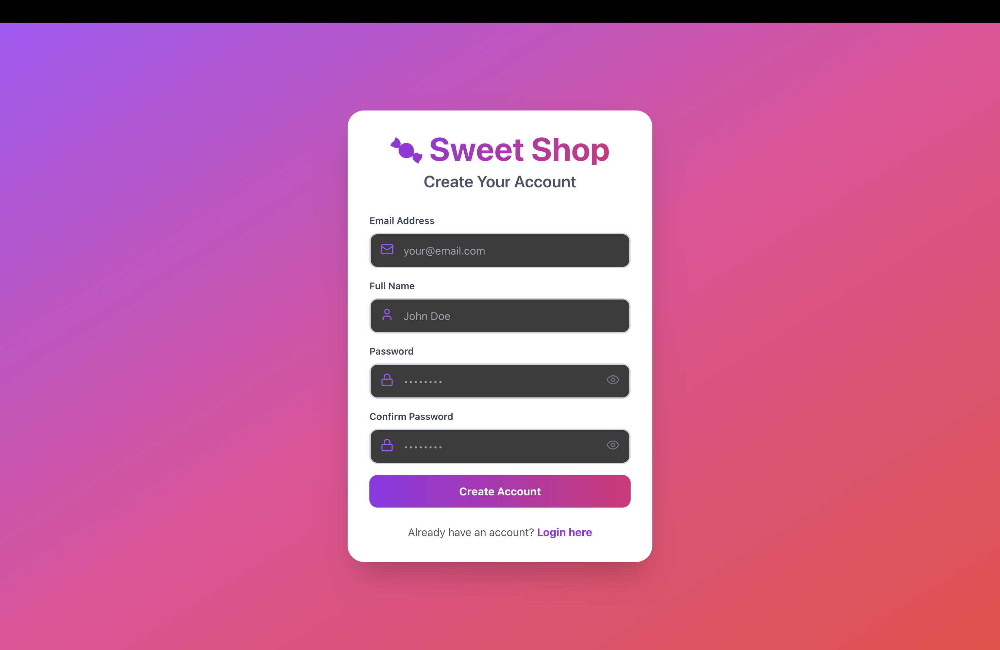
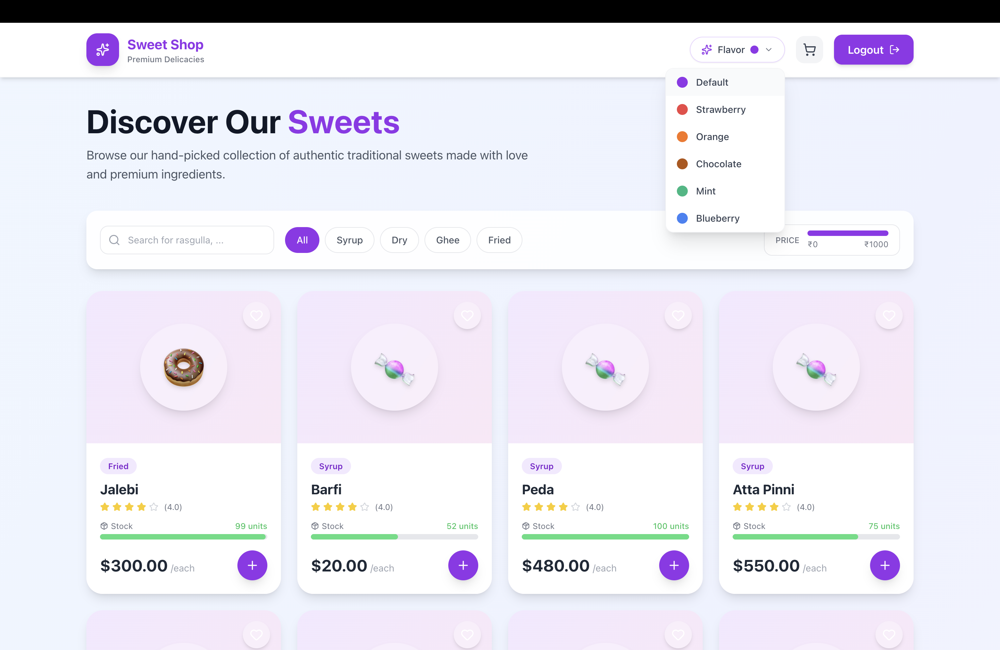
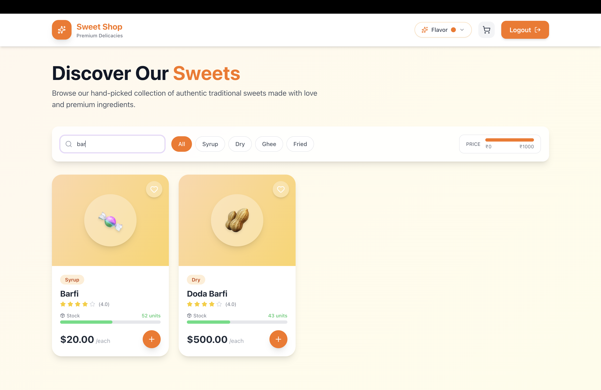
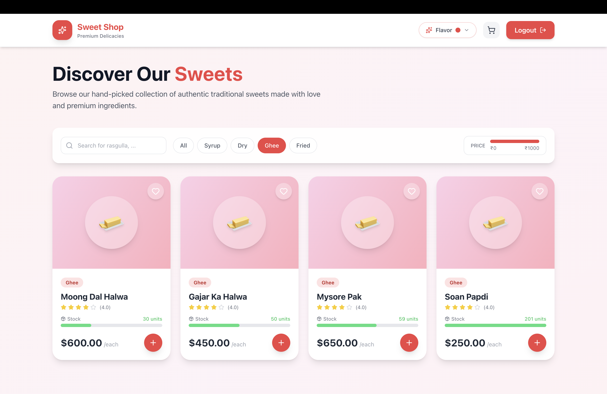
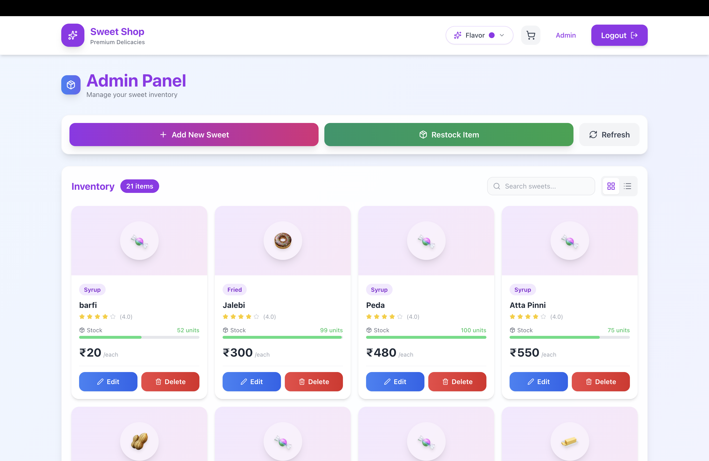
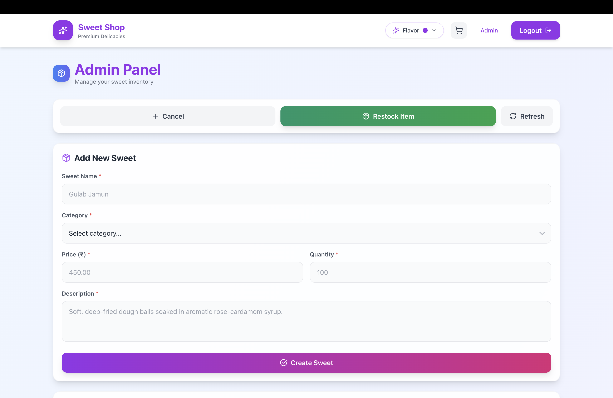
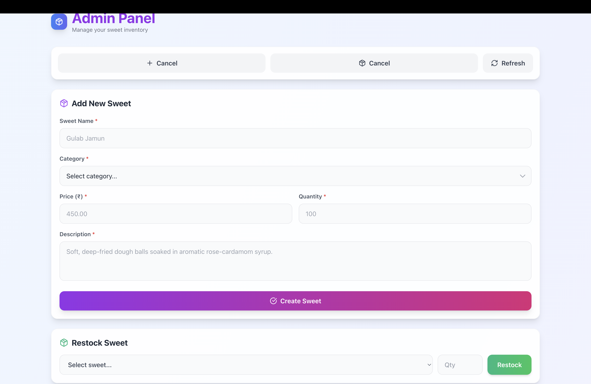
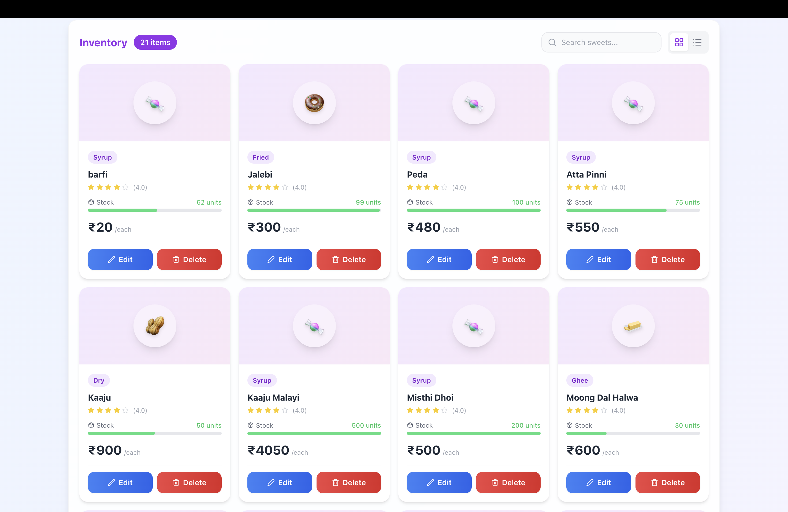
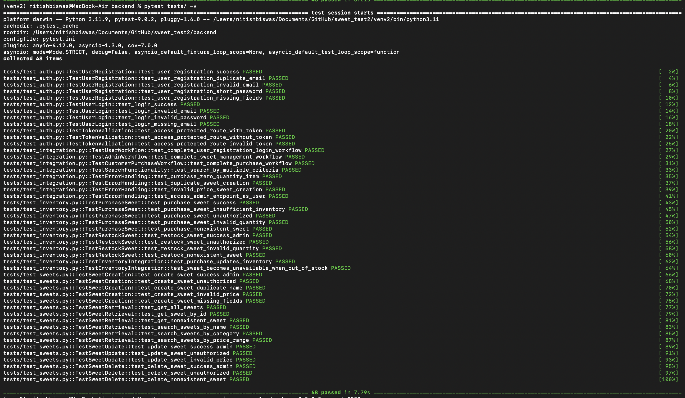

# Sweet Shop Management System

A professional Sweet Shop Management System built with a FastAPI backend and a React (Vite) frontend.

## 🔗 Live Application
**[View Live Application on Vercel (https://sweet-shop-management-vert.vercel.app/)](https://sweet-shop-management-vert.vercel.app/)**

## 🚀 Features

- **Product Management**: Manage sweet inventory with ease.
- **Authentication**: Secure user authentication.
- **Modern UI**: specialized frontend built with React and Tailwind CSS.
- **Robust Backend**: FastAPI powered REST API with SQLAlchemy.
- **Test-Driven Development**: Built with testing in mind using Pytest.

## 🛠️ Tech Stack

### Backend
- **Framework**: FastAPI
- **Database**: SQLite (via SQLAlchemy) (Local) / Supabase (PostgreSQL) (via SQLAlchemy) (Deploy)
- **Testing**: Pytest
- **Python Version**: 3.11+

### Frontend
- **Framework**: React (Vite)
- **Styling**: Tailwind CSS
- **HTTP Client**: Axios

## 💻 Setup Instructions

### Backend Setup

1. Navigate to the backend directory:
   ```bash
   cd backend
   ```

2. Create and activate a virtual environment (if not already exists):
   ```bash
   python -m venv venv
   source venv/bin/activate  # On Windows: venv\Scripts\activate
   ```

3. Install dependencies:
   ```bash
   pip install -r requirements.txt
   ```

4. Configure Environment Variables:
   - Create a `.env` file in the `backend` directory (same level as `.env.example`).
   - Copy the contents from `.env.example` to `.env`.
   - Update the values in `.env` as needed (e.g., `ADMIN_EMAIL`).

5. Run the application:
   ```bash
   python -m uvicorn app.main:app --reload --host 0.0.0.0 --port 8000
   ```
   The API will be available at `http://localhost:8000`.
   

### Frontend Setup

1. Navigate to the frontend directory:
   ```bash
   cd frontend
   ```

2. Install dependencies:
   ```bash
   npm install
   ```

3. Configure Environment Variables:
   - Create a `.env` file in the `frontend` directory (same level as `.env.example`).
   - Copy the contents from `.env.example` to `.env`.
   - Update the values in `.env` as needed.

4. Start the development server:
   ```bash
   npm run dev
   ```
   The application will be running at `http://localhost:5173`.

## 📸 Screenshots

### User Interface
| Login | Signin |
|:---:|:---:|
|  |  |

### Dashboard
| Dashboard View 1 | Dashboard View 2 |
|:---:|:---:|
|  |  |

| Dashboard View 3 |
|:---:|
|  |  |

### Admin Panel
| Admin Panel 1 | Admin Panel 2 |
|:---:|:---:|
|  |  |

| Admin Panel 3 | Admin Panel 4 |
|:---:|:---:|
|  |  |


## Verification


## 🤖 My AI Usage

In compliance with the project requirements, here is a transparent breakdown of how AI tools were utilized during the development of this project.

### Tools Used
- **Gemini**: Primary AI assistant used for syntax reference, debugging, and test generation.

### How AI Was Leveraged
- **Frontend Development**: This was the **primary area of AI usage**. I utilized Gemini to assist with React components and Tailwind CSS styling to ensure a polished and responsive UI.
- **Testing (`pytest`)**: I used AI assistance to help write some of the test cases and understand pytest assertions.
- **Debugging**: Used to explain obscure error messages and suggest quick fixes for syntax errors.

### What Was Done Manually (No AI)
- **Architecture & Design**: The system architecture, folder structure, and database schema were **designed 100% manually**. I did not use AI for high-level design decisions.
- **Core Business Logic**: The main service functions and API structure were written by hand to ensure I had full understanding of the data flow.

### Reflection
Using AI primarily for **Testing** and **Syntax** allowed me to focus my energy on the **Architecture** and **System Design**, which I enjoy the most. It acted as valid "pair programmer" for the tedious parts (like writing test boilerplate) but I maintained full control over the creative and structural aspects of the project.

---

## 🧪 Running Tests

To run the backend test suite:

```bash
cd backend
pytest tests/ -v
```

## 📊 Latest Test Results

<details>
<summary>Click to view full test output (48 Passed)</summary>

```
============================================================================================= test session starts =============================================================================================
platform darwin -- Python 3.11.9, pytest-9.0.2, pluggy-1.6.0 -- /Users/nitishbiswas/Documents/GitHub/sweet_test2/venv2/bin/python3.11
cachedir: .pytest_cache
rootdir: /Users/nitishbiswas/Documents/GitHub/sweet_test2/backend
configfile: pytest.ini
plugins: anyio-4.12.0, asyncio-1.3.0, cov-7.0.0
asyncio: mode=Mode.STRICT, debug=False, asyncio_default_fixture_loop_scope=None, asyncio_default_test_loop_scope=function
collected 48 items                                                                                                                                                                                            

tests/test_auth.py::TestUserRegistration::test_user_registration_success PASSED                                                                                                                         [  2%]
tests/test_auth.py::TestUserRegistration::test_user_registration_duplicate_email PASSED                                                                                                                 [  4%]
tests/test_auth.py::TestUserRegistration::test_user_registration_invalid_email PASSED                                                                                                                   [  6%]
tests/test_auth.py::TestUserRegistration::test_user_registration_short_password PASSED                                                                                                                  [  8%]
tests/test_auth.py::TestUserRegistration::test_user_registration_missing_fields PASSED                                                                                                                  [ 10%]
tests/test_auth.py::TestUserLogin::test_login_success PASSED                                                                                                                                            [ 12%]
tests/test_auth.py::TestUserLogin::test_login_invalid_email PASSED                                                                                                                                      [ 14%]
tests/test_auth.py::TestUserLogin::test_login_invalid_password PASSED                                                                                                                                   [ 16%]
tests/test_auth.py::TestUserLogin::test_login_missing_email PASSED                                                                                                                                      [ 18%]
tests/test_auth.py::TestTokenValidation::test_access_protected_route_with_token PASSED                                                                                                                  [ 20%]
tests/test_auth.py::TestTokenValidation::test_access_protected_route_without_token PASSED                                                                                                               [ 22%]
tests/test_auth.py::TestTokenValidation::test_access_protected_route_invalid_token PASSED                                                                                                               [ 25%]
tests/test_integration.py::TestUserWorkflow::test_complete_user_registration_login_workflow PASSED                                                                                                      [ 27%]
tests/test_integration.py::TestAdminWorkflow::test_complete_sweet_management_workflow PASSED                                                                                                            [ 29%]
tests/test_integration.py::TestCustomerPurchaseWorkflow::test_complete_purchase_workflow PASSED                                                                                                         [ 31%]
tests/test_integration.py::TestSearchFunctionality::test_search_by_multiple_criteria PASSED                                                                                                             [ 33%]
tests/test_integration.py::TestErrorHandling::test_purchase_zero_quantity_item PASSED                                                                                                                   [ 35%]
tests/test_integration.py::TestErrorHandling::test_duplicate_sweet_creation PASSED                                                                                                                      [ 37%]
tests/test_integration.py::TestErrorHandling::test_invalid_price_sweet_creation PASSED                                                                                                                  [ 39%]
tests/test_integration.py::TestErrorHandling::test_access_admin_endpoint_as_user PASSED                                                                                                                 [ 41%]
tests/test_inventory.py::TestPurchaseSweet::test_purchase_sweet_success PASSED                                                                                                                          [ 43%]
tests/test_inventory.py::TestPurchaseSweet::test_purchase_sweet_insufficient_inventory PASSED                                                                                                           [ 45%]
tests/test_inventory.py::TestPurchaseSweet::test_purchase_sweet_unauthorized PASSED                                                                                                                     [ 47%]
tests/test_inventory.py::TestPurchaseSweet::test_purchase_sweet_invalid_quantity PASSED                                                                                                                 [ 50%]
tests/test_inventory.py::TestPurchaseSweet::test_purchase_nonexistent_sweet PASSED                                                                                                                      [ 52%]
tests/test_inventory.py::TestRestockSweet::test_restock_sweet_success_admin PASSED                                                                                                                      [ 54%]
tests/test_inventory.py::TestRestockSweet::test_restock_sweet_unauthorized PASSED                                                                                                                       [ 56%]
tests/test_inventory.py::TestRestockSweet::test_restock_sweet_invalid_quantity PASSED                                                                                                                   [ 58%]
tests/test_inventory.py::TestRestockSweet::test_restock_nonexistent_sweet PASSED                                                                                                                        [ 60%]
tests/test_inventory.py::TestInventoryIntegration::test_purchase_updates_inventory PASSED                                                                                                               [ 62%]
tests/test_inventory.py::TestInventoryIntegration::test_sweet_becomes_unavailable_when_out_of_stock PASSED                                                                                              [ 64%]
tests/test_sweets.py::TestSweetCreation::test_create_sweet_success_admin PASSED                                                                                                                         [ 66%]
tests/test_sweets.py::TestSweetCreation::test_create_sweet_unauthorized PASSED                                                                                                                          [ 68%]
tests/test_sweets.py::TestSweetCreation::test_create_sweet_duplicate_name PASSED                                                                                                                        [ 70%]
tests/test_sweets.py::TestSweetCreation::test_create_sweet_invalid_price PASSED                                                                                                                         [ 72%]
tests/test_sweets.py::TestSweetCreation::test_create_sweet_missing_fields PASSED                                                                                                                        [ 75%]
tests/test_sweets.py::TestSweetRetrieval::test_get_all_sweets PASSED                                                                                                                                    [ 77%]
tests/test_sweets.py::TestSweetRetrieval::test_get_sweet_by_id PASSED                                                                                                                                   [ 79%]
tests/test_sweets.py::TestSweetRetrieval::test_get_nonexistent_sweet PASSED                                                                                                                             [ 81%]
tests/test_sweets.py::TestSweetRetrieval::test_search_sweets_by_name PASSED                                                                                                                             [ 83%]
tests/test_sweets.py::TestSweetRetrieval::test_search_sweets_by_category PASSED                                                                                                                         [ 85%]
tests/test_sweets.py::TestSweetRetrieval::test_search_sweets_by_price_range PASSED                                                                                                                      [ 87%]
tests/test_sweets.py::TestSweetUpdate::test_update_sweet_success_admin PASSED                                                                                                                           [ 89%]
tests/test_sweets.py::TestSweetUpdate::test_update_sweet_unauthorized PASSED                                                                                                                            [ 91%]
tests/test_sweets.py::TestSweetUpdate::test_update_sweet_invalid_price PASSED                                                                                                                           [ 93%]
tests/test_sweets.py::TestSweetDelete::test_delete_sweet_success_admin PASSED                                                                                                                           [ 95%]
tests/test_sweets.py::TestSweetDelete::test_delete_sweet_unauthorized PASSED                                                                                                                            [ 97%]
tests/test_sweets.py::TestSweetDelete::test_delete_nonexistent_sweet PASSED                                                                                                                             [100%]

============================================================================================= 48 passed in 7.79s ==============================================================================================
```
</details>
